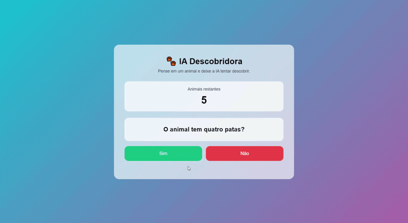
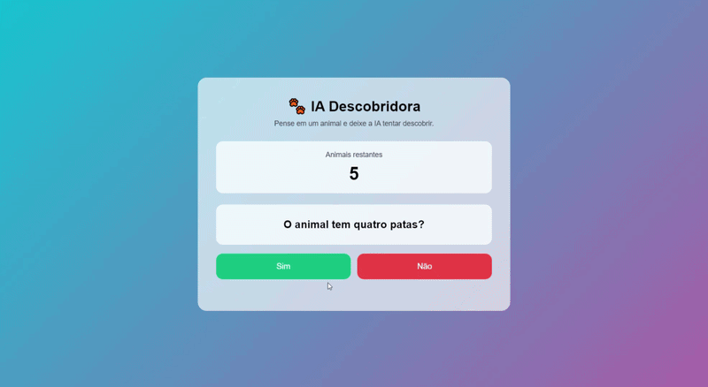

# 🐾 Intelligent Animal Guesser

**Jogo interativo de adivinhação de animais usando lógica e Inteligência Artificial básica.**

---

## 🎯 Descrição

Este projeto é um **jogo interativo** que tenta adivinhar o animal que o usuário está pensando. A aplicação utiliza **lógica e IA básica** para fazer perguntas sobre características dos animais, filtrando as possibilidades até encontrar a resposta correta.

- Desenvolvido com: **HTML, CSS e JavaScript**
- Suporta **adicionar novos animais** e suas características.
- Aprendizado incremental: o jogo **lembra os animais adicionados** em visitas futuras usando **LocalStorage**.

---

## 🖥️ Funcionalidades

1. Perguntas inteligentes baseadas nas características dos animais.
2. Mostra a quantidade de **animais restantes**.
3. Permite ao usuário adicionar **novos animais** com suas características e imagens.
4. Animações divertidas:
   - 🎉 Confetes e efeito pulsante ao acertar
   - 😵 Emojis animados e efeito de tremer ao errar
5. Feedback visual de sucesso ou erro para o usuário.

---

## 🎥 Simulação em execução

**Exemplo de acerto do animal**  


**Exemplo de erro do animal**  


---

## ⚙️ Como jogar

1. Abra o arquivo `index.html` no navegador.
2. Pense em um animal e responda as perguntas com **Sim/Não**.
3. Se o jogo não conseguir descobrir, clique em **Errou** e adicione o animal com suas características.
4. Clique em **Acertou** quando o jogo adivinhar corretamente.
5. Reinicie o jogo a qualquer momento clicando em **Jogar Novamente**.

---

## 🛠️ Tecnologias usadas

- **HTML** – Estrutura da página e formulários
- **CSS** – Layout, cores, animações e efeitos
- **JavaScript** – Lógica do jogo, IA básica e armazenamento local (LocalStorage)

---

## 💡 Detalhes da IA básica

A aplicação utiliza **lógica de filtragem** para descobrir o animal:

1. Para cada pergunta, divide os animais em dois grupos: **Sim / Não**.
2. Escolhe a pergunta que melhor divide as possibilidades restantes.
3. Quando só resta um animal ou não há mais perguntas, o jogo mostra o resultado.
4. Permite adicionar novas características, que se tornam **novas perguntas** para futuras rodadas.

---

## 📂 Estrutura do projeto

```text
Intelligent_Animal_Guesser/
├── index.html
├── style.css
├── script.js
├── images/
│   ├── cachorro.jpg
│   ├── gato.jpg
│   ├── leao.jpg
│   ├── aguia.jpg
│   ├── peixe.jpg
│   ├── cavalo.jpg
│   ├── coelho.jpg
│   ├── porco.jpg
│   ├── pato.jpg
│   ├── galinha.jpg
│   ├── tigre.jpg
│   ├── lobo.jpg
│   ├── leopardo.jpg
│   ├── jacare.jpg
│   ├── sapo.jpg
│   ├── cisne.jpg
│   ├── golfinho.jpg
│   ├── polvo.jpg
│   ├── macaco.jpg
│   ├── papagaio.jpg
│   ├── rato.jpg
│   ├── girafa.jpg
│   ├── elefante.jpg
│   ├── coruja.jpg
│   ├── tartaruga.jpg
└── README.md
```

# 📄 Licença

Este projeto está sob a licença MIT.

Isso significa que o código pode ser utilizado, modificado e distribuído livremente para fins educacionais e pessoais.

---

# 👨‍💻 Autor

Bruno Vinícius Santos  
Engenharia de Computação — INATEL

não faça nada, estou apenas salvando
